---
hide:
  - navigation
title: Showcase
---

# Showcase

A selection of some of the visualizations I have produced. Most of them have been built using python and source code for a lot of them can be found on my github.

!!! tip "Tip"

    Click on the images to reveal a more detailed description of each piece

{ data-gallery="showcase" class="showcase-image" loading=lazy data-title="De Jong Estimator" data-description=".dejong-desc" data-caption-position="right"}
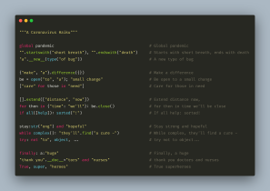{ data-gallery="showcase" class="showcase-image" loading=lazy data-title="Source Code Poetry" data-description=".poem-desc" data-caption-position="right"}
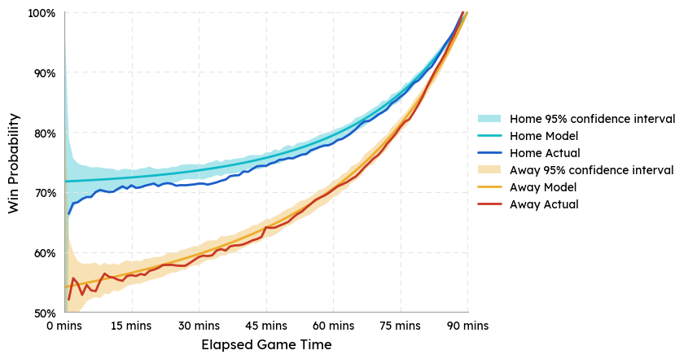{ data-gallery="showcase" class="showcase-image" loading=lazy data-title="Probability of winning given a 1-goal lead" data-description=".win-prob-desc" data-caption-position="top"}
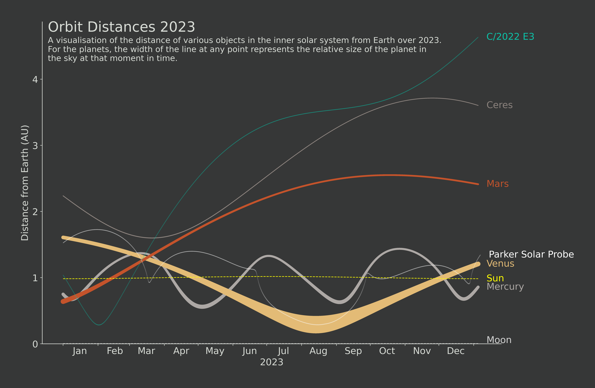{ data-gallery="showcase" class="showcase-image" loading=lazy data-title="Orbits Visualisation" data-description=".orbits-desc" data-caption-position="right"}
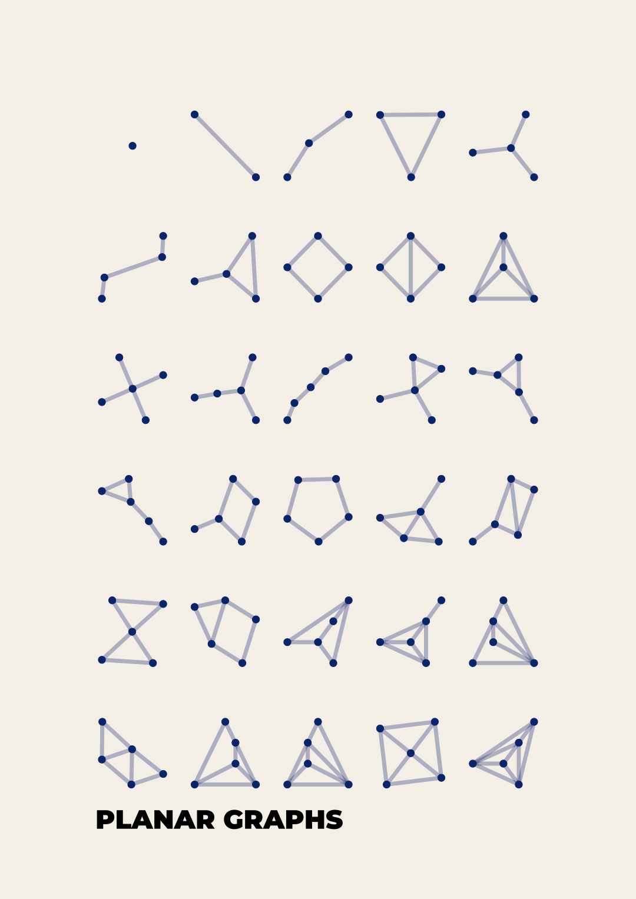{ data-gallery="showcase" class="showcase-image" loading=lazy data-title="Planar Graphs Visualisation" data-description=".planar-desc" data-caption-position="right"}
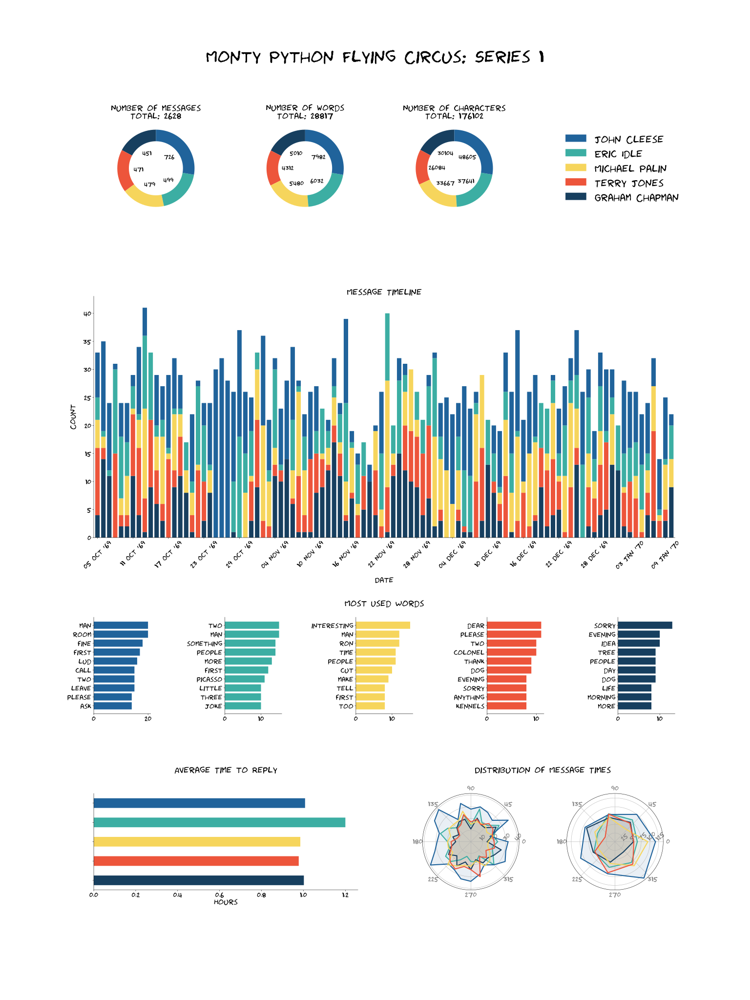{ data-gallery="showcase" class="showcase-image" loading=lazy data-title="Monty Python Script Visualisation" data-description=".monty-desc" data-caption-position="right"}
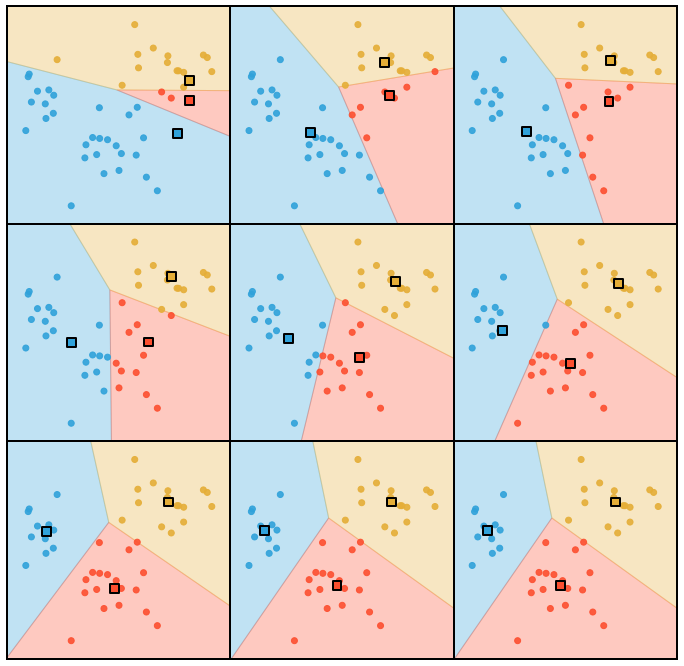{ data-gallery="showcase" class="showcase-image" loading=lazy data-title="K-Means Illustration" data-description=".kmeans-desc" data-caption-position="right"}
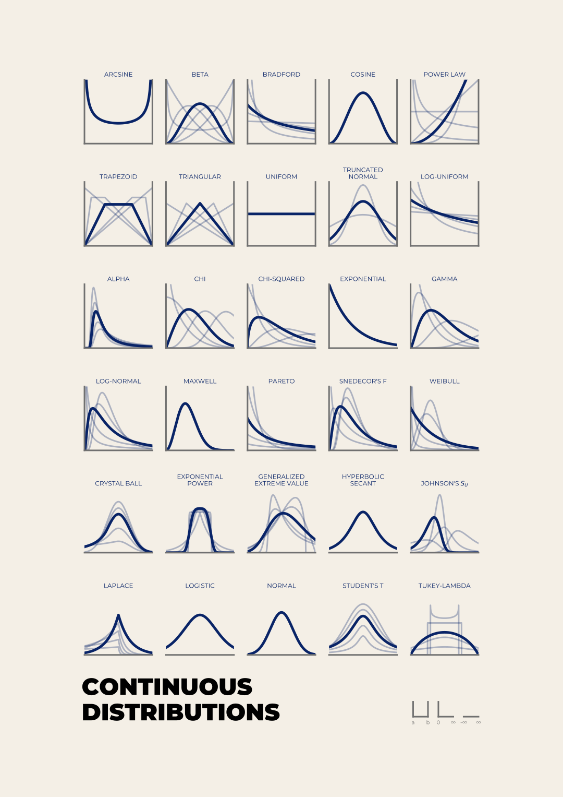{ data-gallery="showcase" class="showcase-image" loading=lazy data-title="Distribution Poster" data-description=".distribution-desc" data-caption-position="right"}
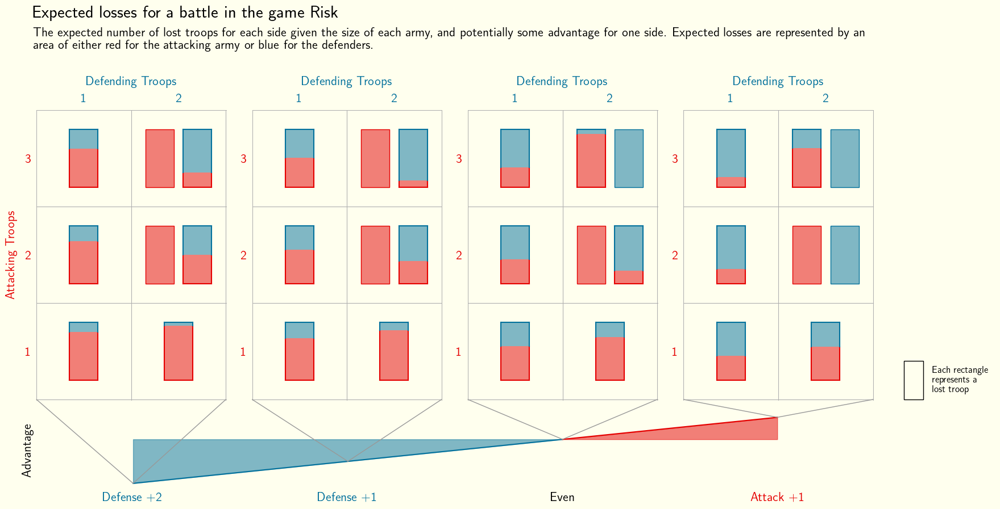{ data-gallery="showcase" class="showcase-image" style="background-color: white" loading=lazy data-title="Risk Visualisation" data-description=".risk-desc" data-caption-position="top"}
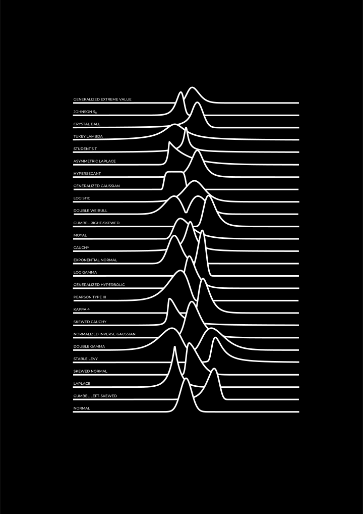{ data-gallery="showcase" class="showcase-image" loading=lazy data-title="Unknown Distributions Poster" data-description=".unknown-dist-desc" data-caption-position="right"}
{ data-gallery="showcase" class="showcase-image" loading=lazy data-title="Planets Visualisation" data-description=".planet-desc" data-caption-position="right"}
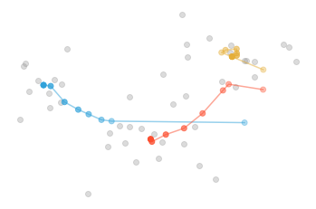{ data-gallery="showcase" class="showcase-image" loading=lazy style="background-color: white" data-title="K-means Visualisation" data-description=".kmeans-trails-desc" data-caption-position="top"}
{ data-gallery="showcase" class="showcase-image" loading=lazy data-title="Clifford Visualisation" data-description=".clifford-desc" data-caption-position="top"}
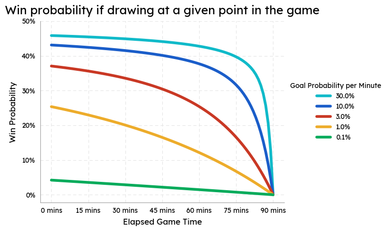{ data-gallery="showcase" class="showcase-image" loading=lazy data-title="Football Draw Visualisation" data-description=".foot-draw-desc" data-caption-position="top"}
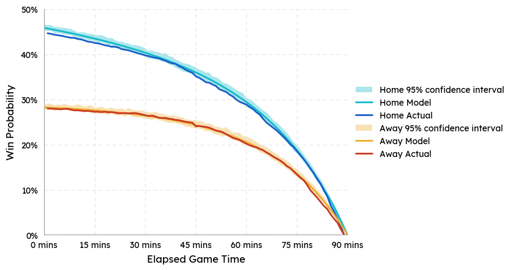{ data-gallery="showcase" class="showcase-image" loading=lazy data-title="Probability of winning a football game given if currently drawing" data-description=".draw-prob-desc" data-caption-position="top"}
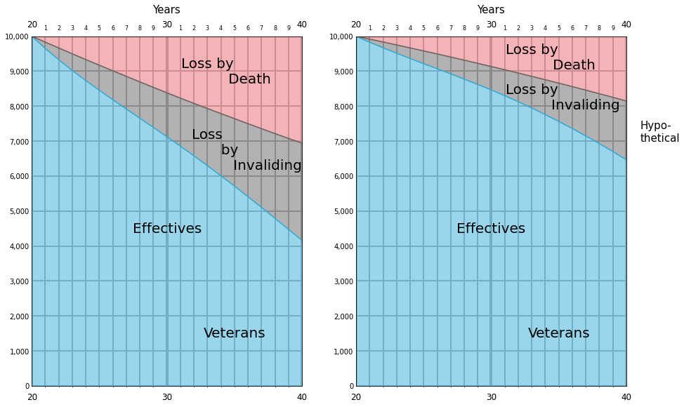{ data-gallery="showcase" class="showcase-image" style="background-color: white" loading=lazy data-title="Florence Nightingale Visualisation Recreation" data-description=".nightingale-desc" data-caption-position="top"}

  
A <b>100 trillion</b> point plot of a De Jong strange attractor with parameters (-1.94 2.06, -1.92, 1.96).

  
To create the image, the De Jong system of equations was iterated 100 trillion times via highly optimized python code using numba, with each resultant (x, y) value incrementing the weight of the pixel value for the closest pixel in a 10,000x10,000 pixel grid. 
  
This image is downscaled from that high-resolution image which is too large to easily share

  
My winning entry to the source code poetry competition, a series of Haiku's about Covid-19 which is also valid python code.

  
For more information, see my blog post 
  <a href="/blog/2020/11/source-code-poetry/" style="color: #00bdd6">here</a>

  
Some analysis of the results of over 15,000 historic premier league and championship games over a 20 year period. This plot shows the probability of a team winning the game if they are leading by 1 goal at a given point in the game. This is split by the home and away team to show the difference in performance depending on the venue.

  
Also, the actual win probabilities for each minute of the game are compared to a simple statistical model that assumes each team scores in a given minute with a fixed probability (~0.03), equal to 1/90th of the average number of goals per game from the dataset. This simple model does a good job explaining the behaviour of this system.

  
A visualisation that leverages the NASA Horizons API to plot the motions of objects in the inner solar system.

  
It is clear to see where the Parker Solar Probe has been slingshotted around some of the inner planets on its way to the Sun, and also puts into perspective the distances of the various planets from Earth throughout the year.

  
The visualisation was built in Python using Matplotlib

  
A poster displaying the 30 possible planar graphs using no more than 5 vertices.

  
A planar graph is a collection of points (vertices) connected by lines (edges), and a planar graph is one that can be drawn on a 2D plane without any of the edges interesecting.

  
The visualisation was built in Python using Matplotlib and NetworkX

  
A visualisation of the script of Monty Python's Flying Circus (Series 1).

  
This was built using a library I developed and open sourced (chatviz) to visualize the messages from a group chat.

  
Monty Python is used here just as an example, where the script takes the place of a group chat. Some notable points include John Cleese having the most lines in the series, and Micheal Palin's most used non-stopword being 'interesting'.

  
The repo can be found here: 
  <a href="https://github.com/lrjball/chatviz" style="color: #00bdd6">lrjball/chatviz</a>

  
A visual explanation of the K-means clustering algorithm

  
Starting with 3 random cluster centers (squares), the algorithm iteratively moves each center to the mean location of all points closest to them. It eventually converges on a sensible clustering.

  
A poster of various continuous probability distributions

  
The poster shows 30 of the most popular continuous distributions, 10 each having bounded, semi-bounded and infinite domains, as indicated by the key in the bottom right.

  
The various lines for each distribution show how the shape changes as the parameters are changed, painting a picture of the full family of each distribution.

  
A visualisation of the battle mechanics of a game of risk.

  
For more information, see my blog post on it <a href="/blog/2023/06/how-risky-is-risk/" style="color: #00bdd6">here</a>

  
Another poster of various continuous probability distributions

  
This one takes inspiration from Joy Division's 'Unknown Pleasures' album cover, which itself was taken from an astronomy visualisation of radio waves from pulsars.

  
26 different distributions are shown here and the visualisation was built using matplotlib.

  
Another visualisation that leverages the NASA Horizons API to plot the motions of objects in the solar systemm this time showing all of the planets sizes relative to Earth.

  
The graphic gives a sense for the distances of the various planets from Earth, and how those distances fluctuate throughout the year.

  
The visualisation was built in Python using Matplotlib

  
Another visual explanation of the K-means clustering algorithm

  
This one shows how the centroids (3 in this case) shift with each iteration, before converging to a final location.

  
Some more experiments with strange attractors. This graphic shows 100 different clifford attractors, generated from different parameters of the equations.

  
Some analysis of the results of over 15,000 historic premier league and championship games over a 20 year period. This plot shows the probability of a team winning the game if they are drawing at a given point in the game. This is split by different goal scoring rates, which changes the results.

  
The actual scoring rate of the premier league over the sampled time period was around 3%, the line shown in red.

  
Some analysis of the results of over 15,000 historic premier league and championship games over a 20 year period. This plot shows the probability of a team winning the game if they are drawing at a given point in the game. This is split by the home and away team to show the difference in performance depending on the venue.

  
Also, the actual win probabilities for each minute of the game are compared to a simple statistical model that assumes each team scores in a given minute with a fixed probability (~0.03), equal to 1/90th of the average number of goals per game from the dataset. This simple model does a good job explaining the behaviour of this system.

  
Florence Nightingale was known for her work as a Nurse, but was also a celebrated statistician and used her data visualisation skills to convince the heads of the British Army to take action during the Crimean War. I've recreated one of her hand-drawn visualisations in python. It shows the current situation of solidier deaths due to improper healthcare, and a hypothetical scenario where proper treatment was put in place.

  
Her convincing portrayal of this data went on to reform healthcare in the army and saved countless lives.

